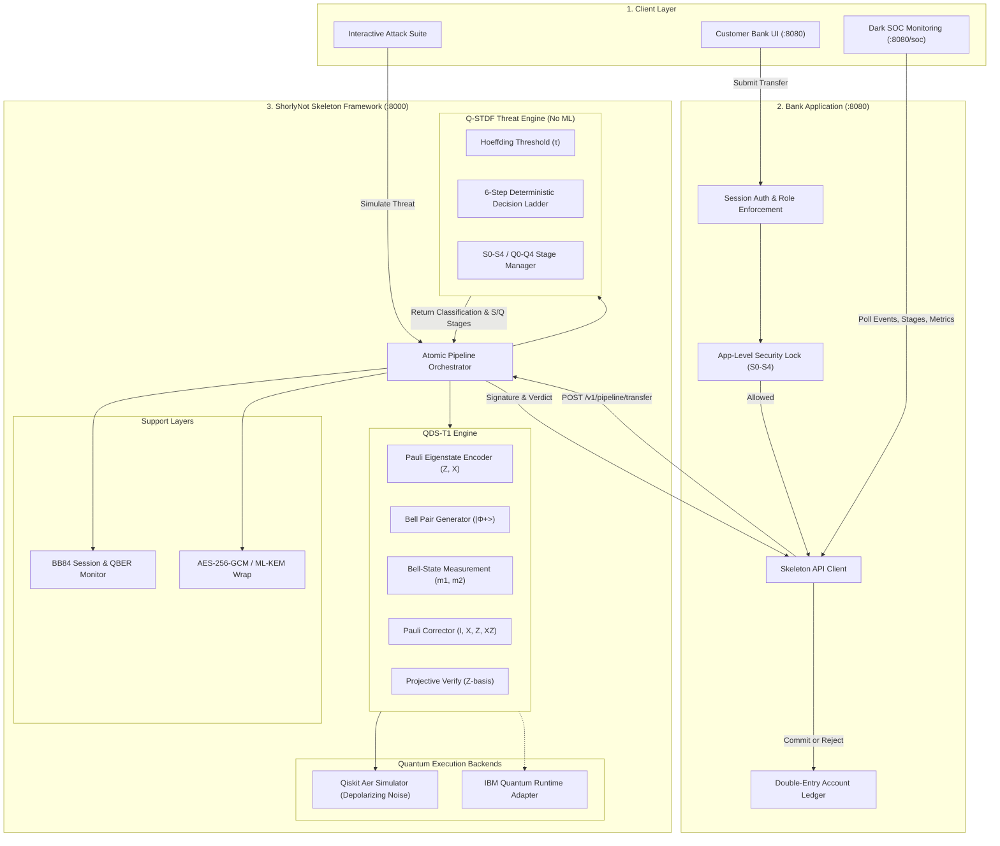

# ARCHITECTURE.md — ShorlyNot System Architecture

## Security Pipeline Flow
1. **User Action**: Alice requests ₹1000 transfer to Bob.
2. **Canonical Commitment**: Bank serializes transaction JSON canonically and derives SHA-256 payload commitment.
3. **QKD Session**: Generates session key material and measures channel QBER ($Q_0 - Q_4$).
4. **QDS-T1 Sign**: Encodes $L=128$ bits as Pauli eigenstates $\{|0\rangle, |1\rangle, |+\rangle, |-\rangle\}$, applies Bell measurements with shared $|\Phi^+\rangle$ pairs, outputs $(m_1, m_2)$ syndromes.
5. **PQC Wrapping**: Encapsulates classical correction syndromes using AES-256-GCM / ML-KEM session keys.
6. **QDS-T1 Verify**: Verifier decrypts syndromes, applies Pauli corrections $\{I, X, Z, XZ\}$, projects onto measurement bases, calculates $\hat{p} = \text{mismatches}/n$.
7. **Q-STDF Classification**: Evaluates Hoeffding bound $\tau$ and protocol bindings (order: `UNAUTH_VERIFY` $\to$ `IMPERSONATION` $\to$ `REPLAY` $\to$ `CHANNEL` $\to$ `FORGERY` $\to$ `OK`).
8. **App Lockdown**: Escalates stage ($S_0 - S_4$). If $S \ge 2$, new transfers are immediately blocked at the application level.
