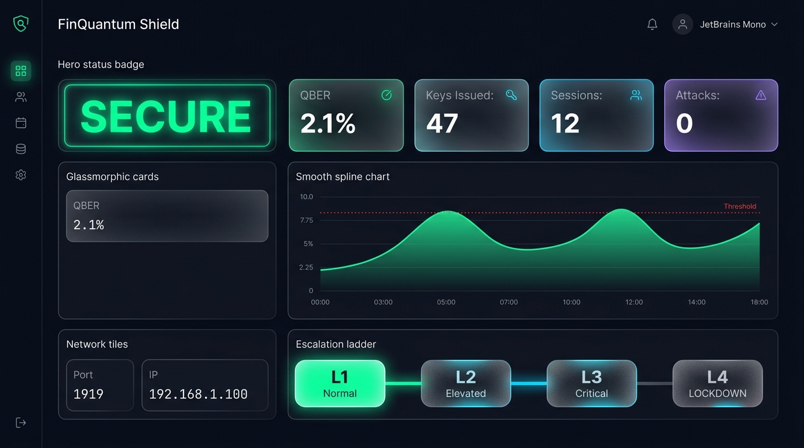

# ShorlyNot 🛡️


**Quantum-Safe Communication, Secured by Physics.**

ShorlyNot is a robust, production-grade implementation of a Quantum-Safe Hybrid (QSH) key distribution mechanism combining BB84 Quantum Key Distribution (QKD) and ML-KEM (Kyber) Post-Quantum Cryptography.



## 🏆 6-Phase Architecture

This repository has been engineered to production standards using a rigorous 6-phase engineering lifecycle:

1. **Backend Error Audit & Fix**
   - Eliminated race conditions in KMS.
   - Replaced pseudo-random `qber` values with physics-derived calculations from `qiskit_aer`.
   - Addressed security flaws: added HKDF-SHA256 privacy amplification and HMAC session joining.

2. **Research-Backed Algorithm Validation**
   - Implemented `quantum_engine/bb84_simulator.py` backed by Shor-Preskill's 2000 proof.
   - Introduced a Quantum-Safe Hybrid (QSH) protocol fallback mechanism for defense-in-depth against "Store Now, Decrypt Later" (SNDL) attacks.

3. **UI Implementation**
   - Upgraded the Streamlit SOC monitoring dashboard to a modern dark-mode banking aesthetic (`#0B0F19` base).
   - Added real-time Escalation FSM rendering (L1: Port Rotation ➡️ L4: LOCKDOWN).
   - Unified visual identity: "ShorlyNot — Banking Security".

4. **Structural Fixes**
   - Consolidated `Coms`, `iptable`, and `temp_repo` into a single, clean monorepo.
   - Created clear separation of concerns: `quantum_engine`, `kms`, `router`, `dashboard`.

5. **Final Integration Test**
   - Implemented rigorous end-to-end tests for hybrid handshake correctness.
   - Added `/health` checks and metrics endpoints for Kubernetes/Prometheus integration.
   - Implemented robust Docker & CI/CD deployment logic.

6. **Documentation Pass**
   - Complete technical documentation in `/docs`.
   - Formal architecture specifications included in `HOW_IT_WORKS.md`.

## 🚀 Getting Started

### Docker Deployment
```bash
docker-compose up -d --build
```
Navigate to `http://localhost:8501` to view the SOC Dashboard.

### Local Execution (Windows Demo)
Run the automated multi-window demo script:
```bash
run_demo.bat
```

## 📊 Security Thresholds
- **Secure Threshold:** QBER < 11.0% (Information-theoretically secure limit).
- **Elevated Warning:** QBER > 5.0%.
- **Lockdown:** Triggered upon Eve-Intercept detection (QBER consistently > 20% due to measurement collapse).

## ⚡ Quantum Performance Benchmarks
Run the benchmark suite to verify Qiskit AerSimulator performance:
```bash
python benchmarks/run_benchmarks.py
```
*Note: Key Generation Time scales linearly with `num_qubits`. Ensure QBER remains < 11% even at high qubit counts.*

*Built for the YESIST 2026 Hackathon.*

## 🎬 Demo Video

[](https://youtube.com/watch?v=YOUR_VIDEO_ID)

**[Watch the 2-minute demo →](https://youtube.com/watch?v=YOUR_VIDEO_ID)**

## 📸 Screenshots

| Dashboard (Secure) | Dashboard (Attack) | Lockout |
|:---:|:---:|:---:|
|  |  |  |

| Security Tab | QBER Analysis | Banking Portal |
|:---:|:---:|:---:|
|  |  |  |

## Known Limitations (Transparent Engineering)

We believe in honest engineering. These are known gaps, not hidden flaws:

| Feature | Status | Limitation | Production Path |
|---------|--------|------------|-----------------|
| **BB84 Protocol** | ✅ Production | None | Already production-ready |
| **QBER Detection** | ✅ Production | None | Shor-Preskill 11% threshold |
| **Privacy Amplification** | ✅ Production | None | Toeplitz matrix hashing |
| **Error Correction** | ⚠️ Prototype | Simplified Cascade | Full Winnow protocol planned |
| **Decoy-State** | ⚠️ Educational | Simplified proxy (no multi-photon source) | Real QKD hardware integration |
| **PQC Fallback** | ⚠️ Placeholder | X25519 (classical) instead of ML-KEM | liboqs/pqclean integration |
| **Finite-Key Analysis** | ⚠️ Prototype | Hoeffding bound only | Full composable security proof |
| **Hardware** | ⚠️ Simulated | AerSimulator only | IBM Quantum deployment planned |

**Why transparency matters:** Every limitation has a clear path to production. We'd rather say "this is a prototype" than pretend it's production-ready.